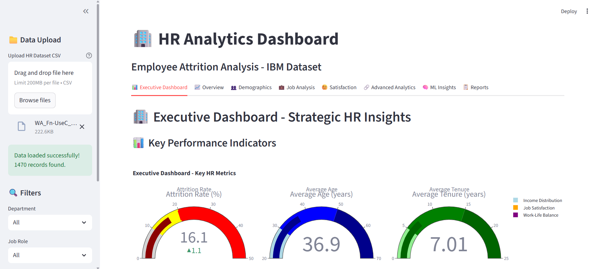
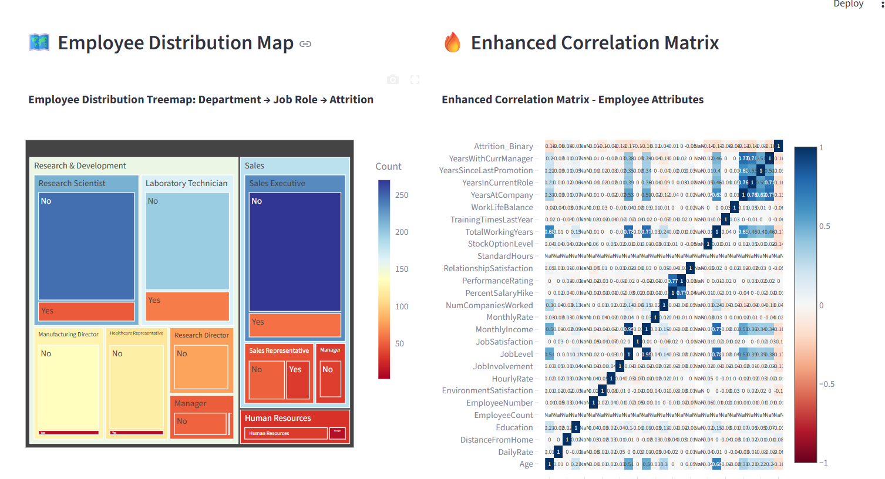

# 📊 AttritionPredict – Advanced HR Analytics Dashboard


---

## 🚀 Overview

An interactive, feature-rich **HR Analytics Dashboard** built using **Streamlit** to explore, analyze, and predict employee attrition using IBM's HR dataset. Designed for strategic decision-makers, HR professionals, and data enthusiasts who seek **deep workforce insights** through interactive visualizations, statistical modeling, and machine learning techniques.

## 🖼️ UI Preview



## 🎯 Analysis Output Screenshot



## 🎯 AI & ML Output Screenshot


---

## 🚀 Key Features

### 📌 Executive Overview
- Interactive **KPI Gauges** (Attrition Rate, Tenure, Income, etc.)
- **3D Visual Analysis** with hover-driven storytelling
- Dynamic filtering for real-time data slicing

### 📊 Advanced Analytics
- **Parallel Coordinates Plots** for multi-dimensional data views
- **Sunburst Charts** and **Radar Plots** for categorical pattern discovery
- **Waterfall Charts** to visualize factor-wise attrition breakdown

### 🧠 Machine Learning Insights
- **Principal Component Analysis (PCA)** for dimensionality reduction
- **Clustering Algorithms** (K-Means, DBSCAN) for grouping employee types
- **Predictive Models** (Logistic Regression, Decision Trees) for attrition forecasting
- **Model Evaluation** with metrics like accuracy, ROC-AUC

### 📈 Statistical Deep-Dive
- **Correlation Matrices & Heatmaps**
- **Cohort Analysis** to understand retention by join period
- **Survival Analysis** to analyze employee tenure distributions

### 🧾 Reporting & Exporting
- Auto-generated **Strategic Recommendations**
- Export **all visuals, dataframes, and model outputs** to CSV, PNG

---

## 📊 Technologies Used

- **Frontend**: Streamlit
- **Data**: Pandas, NumPy
- **Visuals**: Plotly, Seaborn, Matplotlib, Altair
- **ML & Stats**: Scikit-learn, Lifelines, SciPy, Statsmodels

---

## 🗂️ Project Structure

```
MoneyMind/
│
├── 📁 data/ # Sample and uploaded datasets
├── 📁 models/ # Trained machine learning models
├── 📁 pages/ # Streamlit multipage structure
├── 📁 reports/ # Exported charts and reports
├── 📜 app.py # Main Streamlit app
├── 📜 utils.py # Helper functions
├── 📜 requirements.txt # Project dependencies
└── 📜 README.md # Project documentation
```

---

## 🛠️ How to Run

1. Clone the repository:
   ```bash
   git clone https://github.com/yourusername/AttritionPredict.git
   cd AttritionPredict
   ```

2. Create a virtual environment (optional but recommended):
   ```bash
   python -m venv venv
    .\venv\Scripts\activate
   ```

3. Install dependencies:
   ```bash
   pip install -r requirements.txt
   ```

4. Run the app:
   ```bash
   streamlit run app.py
   ```

5. If you face issues with 0.0.0.0, use:
   ```
   streamlit run app.py --server.address=localhost --server.port=8501
   ```
---
## 📌 Future Improvements

Real-time API integration with HRMS

Auth-enabled HR manager login

Time-series forecasting of attrition trends

Feedback-driven model fine-tuning

---

## 📘 License

This project is licensed under the MIT License – see the [LICENSE](/license.txt) file for details.

---

## 🙌 Credits

Made with ❤️ by [Aditya Arora](https://www.linkedin.com/in/NeuralAditya)  
&copy; 2025 Aditya Arora. All rights reserved.

---
